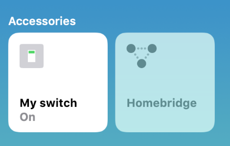

# homebridge-automation-phat
> Project to integrate a Pimoroni Automation (p)HAT on a Raspberry Pi Zero W with Apple's Homekit using Homebridge


This is the code for a basic homebridge plugin and a python server. By running both on a [Raspberry Pi 0W](https://shop.pimoroni.com/products/raspberry-pi-zero-wh-with-pre-soldered-header) with the [Automation HAT](https://shop.pimoroni.com/products/automation-hat) installed you can add a relay as a switch to your Homekit and control it with Siri. 

Obviously the Automation HAT is capable of much more and this project is a good start for more abitious home automation projects. Remember don't use the Automation HAT to directly switch mains electricity! 



## Installation

1. You need a [Raspberry Pi with Raspian installed](https://projects.raspberrypi.org/en/projects/raspberry-pi-setting-up). 
2. Install the [Automation (p)HAT](https://learn.pimoroni.com/tutorial/sandyj/getting-started-with-automation-hat-and-phat)
3. Install [Homebridge](https://github.com/nfarina/homebridge/wiki/Running-HomeBridge-on-a-Raspberry-Pi)
4. Add homebridge as an accessory in your home app on IOS
4. Open a terminal and clone this repository ```git clone https://github.com/dropletmedia/homebridge-automation-hat.git
```
5. move or copy the ```config.json``` file into your ```home/pi/.homebridge``` folder.
6. Make sure flask is installed 
```sudo pip3 install flask```
7. use npm to install the homebridge plugin globally 
``` npm install -g ~/homebridge-automation-hat```
8. Restart homebridge 
9. start the server ```python ~/homebridge-automation-hat/server.py```
10. Add the switch accessory to your home app on IOS


## Usage example

I have connected some Led light strips with a music sensitive controller to my automation phat's relay. I've put them up in my shed, and with an Apple homepod and iphone I've set up a siri shortcut to play a playlist and turn the lights on when I say "Hey Siri, disco shed!!' 


## Meta

Phil Picton – [@dropletmediaUK](https://twitter.com/dropletmediauk) - [https://dropletmedia.co.uk](https://dropletmedia.co.uk)

Distributed under the MIT license. See ``LICENSE`` for more information.

[https://github.com/dropletmedia](https://github.com/dropletmedia)

## Contributing

1. Fork it (<https://github.com/dropletmedia/homekit-automation-hat/fork>)
2. Create your feature branch (`git checkout -b feature/fooBar`)
3. Commit your changes (`git commit -am 'Add some fooBar'`)
4. Push to the branch (`git push origin feature/fooBar`)
5. Create a new Pull Request